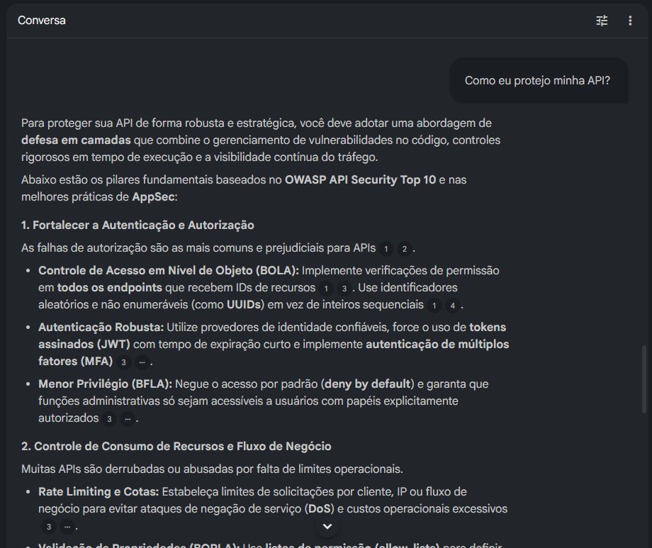
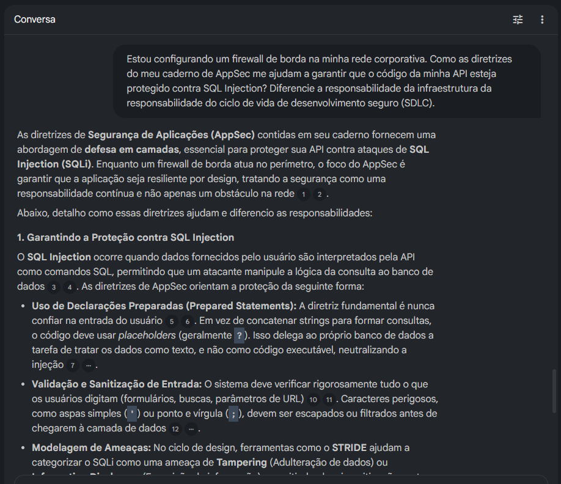
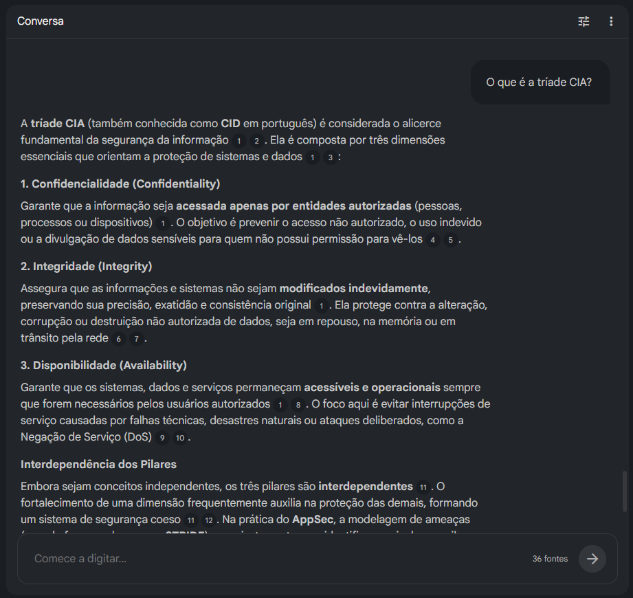

# 🛡️ Caderno Temático: Segurança de Aplicações (AppSec) & Modelagem de Ameaças
### Um pilar especializado e estratégico da Cibersegurança (Cybersecurity)

  

---

## 🧭 Caderno Interativo (NotebookLM)

Este projeto utiliza o **Google NotebookLM** como uma central de inteligência artificial aumentada para aprofundamento em AppSec. A IA foi alimentada com as fontes confiáveis listadas na curadoria abaixo, garantindo respostas fundamentadas, técnicas e livres de alucinações.

* 🚀 **Link de Acesso:** **[Clique aqui para acessar o NotebookLM Compartilhado](https://notebooklm.google.com/notebook/740dc007-b187-49c0-ade7-7089f4ebfb21)**
* 🧠 **Como interagir:** Você pode utilizar o caderno para fazer perguntas complexas, gerar novos resumos baseados nas fontes ou utilizar os [Prompts Reutilizáveis](#3-prompts-reutilizáveis-para-revisão) incluídos no final deste guia.

---

## 📝 Contexto e Objetivos

Este repositório foi desenvolvido como parte de um desafio prático de projeto para a **DIO (Digital Innovation One)**, utilizando o **NotebookLM** para consolidar conhecimentos críticos em segurança. 

Enquanto a Cibersegurança protege ativos digitais de forma ampla, este caderno foca especificamente em **Segurança de Aplicações (AppSec)** — o processo estratégico de encontrar, corrigir e prevenir vulnerabilidades durante todo o ciclo de vida de desenvolvimento de software (SDLC). O objetivo principal é dominar as defesas necessárias para garantir a confidencialidade, integridade e disponibilidade (**tríade CIA**) dos sistemas desde a concepção do código.

---

### 🎯 Objetivos de Estudo

* **Compreender o Ciclo de Modelagem de Ameaças:** Aprender a identificar sistematicamente o que pode dar errado no design de um sistema utilizando metodologias como **STRIDE** ou **PASTA** para planejar mitigações de baixo custo.
* **Mapear Vulnerabilidades Críticas & Defesas:** Analisar as falhas mais severas apontadas pelo **OWASP Top 10:2025**, estendendo o estudo para riscos específicos em APIs e aplicações de Inteligência Artificial (LLMs).
* **Explorar Ferramentas de Automação:** Entender a aplicação de tecnologias como **SAST** (análise estática), **DAST** (análise dinâmica) e **SCA** (análise de composição) para escalar a segurança e proteger a cadeia de suprimentos de software.
* **Criar um Portfólio de Consulta Rápida:** Estruturar um repositório de conhecimento com *cheat sheets*, glossários técnicos e padrões de requisitos reutilizáveis para apoiar futuras auditorias e revisões de código.

---

## 📚 Curadoria de Fontes (Ingeridas no NotebookLM)

Para garantir o rigor técnico e evitar alucinações da IA, o NotebookLM foi alimentado com uma curadoria de 5 pilares fundamentais, divididos entre artigos de referência técnica e palestras especializadas:

### 📑 Artigos e Documentações Oficiais
1.  [AWS Blog: Como abordar a modelagem de ameaças](https://aws.amazon.com/pt/blogs/aws-brasil/como-abordar-a-modelagem-de-ameacas/) – Guia prático sobre o framework mental de modelagem de ameaças e a importância de responder às quatro perguntas fundamentais: *No que estamos trabalhando? O que pode dar errado? O que vamos fazer a respeito? Fizemos um bom trabalho?*
2.  [daily.dev Blog: Top 10 Threat Modeling Tools Compared (2024)](https://daily.dev/blog/top-10-threat-modeling-tools-compared-2024/) – Análise comparativa das ferramentas líderes de mercado para mapeamento de ameaças (como OWASP Threat Dragon, Microsoft Threat Modeling Tool, IriusRisk e Threat Modeler).
3.  [OWASP Cheat Sheet Series](https://cheatsheetseries.owasp.org/) – Repositório definitivo de boas práticas e guias defensivos detalhados para desenvolvedores (focado em prevenção de SQLi, XSS, manipulação segura de cookies e cabeçalhos HTTP).

### 🎥 Palestras Técnicas (Harvard CS50 Cybersecurity Series)
4.  **Fundamentos de AppSec e OWASP Top 10:**
    * *HackStation:* [OWASP TOP 10: As Falhas MAIS CRÍTICAS em Aplicações Web](http://www.youtube.com/watch?v=n8nI_IsH7rM) – Visão geral e demonstração do impacto de vulnerabilidades fundamentais (Broken Access Control, Cryptographic Failures, SSRF).
    * *CS50:* [Lecture 0 - Securing Accounts](http://www.youtube.com/watch?v=kUovJpWqEMk) – Estudo sobre autenticação, engenharia social, rate-limiting, gerenciadores de senhas e passkeys.
5.  **Defesas de Infraestrutura, Software e Privacidade:**
    * *CS50:* [Lecture 1 - Securing Data](http://www.youtube.com/watch?v=X3DVaMnl5n8) – Hashing de senhas, uso de Salts, criptografia simétrica (AES) vs. assimétrica (RSA), troca de chaves (Diffie-Hellman) e assinaturas digitais.
    * *CS50:* [Lecture 2 - Securing Systems](http://www.youtube.com/watch?v=9phdZjF8qOk) – Redes Wi-Fi seguras, ataques de Machine-in-the-Middle (MitM), cabeçalhos defensivos (HSTS), firewalls, proxies, vírus, worms e botnets.
    * *CS50:* [Lecture 3 - Securing Software](http://www.youtube.com/watch?v=5rsKrTh3fAo) – Engenharia de exploração de vulnerabilidades web na prática, incluindo Cross-Site Scripting (XSS), SQL Injection (SQLi), Command Injection, manipulação de validações Client-Side vs. Server-Side e Cross-Site Request Forgery (CSRF).
    * *CS50:* [Lecture 4 - Preserving Privacy](http://www.youtube.com/watch?v=6IeqJtudKnk) – Análise de logs de servidores, cabeçalhos HTTP de privacidade (Referrer-Policy), Browser Fingerprinting, anatomia e ciclo de vida de cookies (Session, Tracking e Supercookies) e DNS over HTTPS (DoH).

---
## 🧠 Engenharia de Prompts e Evidências Práticas

Nesta seção estão documentados os testes de prompt realizados no NotebookLM e as evidências visuais das interações com a IA, demonstrando o processo de iteração para refinar o conhecimento técnico e validar o escopo do caderno de AppSec.

### 🧪 Caso de Teste 1: Alinhamento Inicial de Escopo (Foco Nativo em AppSec)
* **Prompt Inicial:** *"Como eu protejo minha API?"*
* **Resultado Real:** Diferente do esperado para uma pergunta ampla, a IA trouxe uma resposta profundamente alinhada ao escopo de AppSec. Em vez de focar em segurança de infraestrutura tradicional, ela estruturou a resposta com base no OWASP API Security Top 10 e em práticas modernas de desenvolvimento seguro.
* **Destaques da Resposta:**
    * **Controles de Acesso Específicos:** Abordou falhas críticas de lógica como BOLA (Broken Object Level Authorization) e BFLA (Broken Function Level Authorization), recomendando o uso de UUIDs e princípio do menor privilégio.
    * **Ciclo de Vida (DevSecOps) e Riscos Modernos:** Recomendou explicitamente a integração de ferramentas SAST, DAST e SCA no SDLC, além de trazer uma camada atualizada sobre segurança em integrações com LLMs (Injeção de Prompt e Excessiva Agência).
    * **Recomendação Estratégica:** Ao final, a própria IA sugeriu proativamente a realização de um exercício de **Modelagem de Ameaças (STRIDE/PASTA)** como o próximo passo ideal.

#### 📸 Evidência de Interação 01 (NotebookLM)

---

### 🧪 Caso de Teste 2: Aprofundamento e Divisão de Responsabilidades (Infraestrutura vs. SDLC)
* **Prompt de Aprofundamento:** *"Estou configurando um firewall de borda na minha rede corporativa. Como as diretrizes do meu caderno de AppSec me ajudam a garantir que o código da minha API esteja protegido contra SQL Injection? Diferencie a responsabilidade da infraestrutura da responsabilidade do ciclo de vida de desenvolvimento seguro (SDLC)."*
* **Resultado Real:** A IA validou com precisão o conceito de defesa em camadas. Ela explicou como as diretrizes de AppSec atuam na raiz do problema (neutralizando o SQLi no código através de *Prepared Statements* e sanitização) e traçou uma linha clara de responsabilidades.
* **Destaques da Resposta:**
    * **Responsabilidade da Infraestrutura (Tempo de Execução):** Atua na filtragem de perímetro e tráfego através de WAF (Firewall de Aplicação Web), RASP (Runtime Application Self-Protection) e na aplicação do menor privilégio diretamente nas contas do Banco de Dados.
    * **Responsabilidade do SDLC (Segurança por Design):** Foca na eliminação da vulnerabilidade na origem por meio de esteiras automatizadas de DevSecOps, utilizando SAST (análise de código), DAST (testes dinâmicos em runtime) e SCA (análise de vulnerabilidades em componentes de terceiros).
    * **Metáfora de Fechamento:** A IA sintetizou o alinhamento com maestria ao pontuar que *"a infraestrutura fornece o 'remédio' contra ataques ativos, enquanto o SDLC fornece a 'cura', garantindo que o código nasça robusto"*.

#### 📸 Evidência de Interação 02 (NotebookLM)

---

### 🧪 Caso de Teste 3: Fundamentos de Segurança e Interdependência (A Tríade CIA/CID)
* **Prompt Inicial:** *"O que é a tríade CIA?"*
* **Resultado Real:** A IA apresentou uma explicação sólida e estruturada sobre o alicerce fundamental da segurança da informação, definindo com clareza as três dimensões (Confidencialidade, Integridade e Disponibilidade). O grande diferencial foi a capacidade do NotebookLM de conectar esses conceitos teóricos diretamente à prática de desenvolvimento seguro ao final da resposta.
* **Destaques da Resposta:**
    * **Confidencialidade:** Detalhou o foco em garantir o acesso estritamente a entidades autorizadas, prevenindo a exposição ou vazamento de dados sensíveis.
    * **Integridade:** Abordou a preservação da exatidão e consistência dos dados, protegendo contra alterações ou corrupções não autorizadas em repouso, memória ou trânsito.
    * **Disponibilidade:** Destacou a necessidade de manter sistemas operacionais e acessíveis, mitigando riscos como falhas técnicas ou ataques de Negação de Serviço (DoS).
    * **Conexão com AppSec:** A IA demonstrou maturidade ao fechar a resposta explicando a interdependência dos pilares e amarrando-os à **Modelagem de Ameaças (STRIDE)**. Ela pontuou que, no contexto de AppSec, o framework serve justamente para mapear quais dessas três dimensões estão em risco desde o design do software.

#### 📸 Evidência de Interação 03 (NotebookLM)

---

# 🚀 Miniguia de Estudo: AppSec & Modelagem de Ameaças
## 📊 Infográfico Temático: APIs, IA e Estratégias de Defesa

O infográfico abaixo foi estruturado a partir da síntese de dados e insights gerados nativamente pelo **Google NotebookLM** durante o processo de curadoria deste projeto. Ele mapeia visualmente as interdependências entre as novas fronteiras de risco e as metodologias de teste recomendadas pelo ecossistema de AppSec.

  
  
<em>Infográfico descritivo baseado no mapeamento conceitual do NotebookLM.</em>

---
## 1. Resumos Estruturados

### A Essência do AppSec
A Segurança de Aplicações (AppSec) foca em encontrar, corrigir e prevenir vulnerabilidades em todo o ciclo de vida de desenvolvimento de software (SDLC). O objetivo central é proteger a tríade CIA:
* **Confidencialidade:** Acesso apenas por entidades autorizadas.
* **Integridade:** Garantia de que os dados não foram modificados indevidamente.
* **Disponibilidade:** Sistemas acessíveis sempre que necessário.

### Modelagem de Ameaças: "Segurança por Design"
É uma abordagem sistemática realizada preferencialmente na fase de design do projeto para identificar o que pode dar errado.
* **Framework STRIDE:** Utilizado para categorizar ameaças (Falsificação, Adulteração, Repúdio, Exposição de Dados, Negação de Serviço e Elevação de Privilégio).
* **Framework PASTA:** Uma metodologia centrada no risco que alinha objetivos de negócio com requisitos técnicos de segurança.

### Ecossistema OWASP
A OWASP fornece guias críticos que representam o consenso global sobre riscos:
* **Top 10 Web:** Focado em falhas como Quebra de Controle de Acesso e Injeção.
* **Top 10 API:** Endereça riscos específicos como o BOLA (Controle de Acesso em Nível de Objeto Quebrado).
* **Top 10 LLM:** Foca em ameaças de Inteligência Artificial, como Injeção de Prompt e manipulação semântica.

---

## 2. Glossário de Conceitos Chave
* **SAST (Static Application Security Testing):** Análise do código-fonte em busca de falhas sem executar a aplicação.
* **DAST (Dynamic Application Security Testing):** Teste de segurança com a aplicação em execução, simulando ataques externos.
* **SCA (Software Composition Analysis):** Identificação de vulnerabilidades conhecidas em bibliotecas de terceiros (cadeia de suprimentos).
* **RASP (Runtime Application Self-Protection):** Proteção que atua de dentro da aplicação em tempo de execução.
* **CVE (Common Vulnerabilities and Exposures):** Lista pública de falhas de segurança documentadas e reconhecidas.
* **BOLA (Broken Object Level Authorization):** Falha grave em APIs onde um usuário acessa dados de outros usuários apenas alterando um ID na requisição.

---

## 3. Prompts Reutilizáveis para Revisão
Utilize estes prompts em IAs para aprofundar ou revisar o tema:

1. **Revisão de Framework:**
   > "Explique como cada letra do acrônimo STRIDE se aplicaria para proteger o fluxo de dados de um formulário de login que se conecta a uma API."

2. **Análise de Ferramentas:**
   > "Compare as vantagens de usar SAST durante o desenvolvimento versus DAST em um ambiente de staging para uma aplicação que utiliza microsserviços."

3. **Cenário de Ameaça IA:**
   > "Com base no OWASP LLM Top 10, quais controles de segurança eu deveria implementar em um chatbot corporativo que utiliza RAG para evitar o vazamento de dados sensíveis?"

4. **Simulação de Red Team:**
   > "Atue como um analista de segurança ofensiva. Quais são os vetores de ataque mais prováveis para uma API que não implementa Rate Limiting e utiliza IDs sequenciais?"
